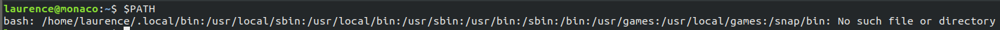

## brief

I have been using Ansible for a about 2.5 years now and if you are familiar with Ansible, you will know that it is great for configuration management, but with infrastructure, although very capable, falls down in a few areas. The general consenus I have read, is that Terraform fills this gap.
<!--more-->
## method

First of all you will need to install Terraform, I am using ubuntu 18.04 writing this article so will initiialy cover this method first.

The download is avaiable from: [Terraform Download](https://www.terraform.io/downloads.html)

In this instance scroll to the Linux section and click the 64bit download link. This will download the Terraform binary which now needs to be added your path to work.

The documetnation points towards this article for help on adding this binary to your environment path. [https://superuser.com/questions/284342/what-are-path-and-other-environment-variables-and-how-can-i-set-or-use-them](https://superuser.com/questions/284342/what-are-path-and-other-environment-variables-and-how-can-i-set-or-use-them)

The easiest way I have found to accomplish this is by moving terraform to my user local bin in my home directory:

First of all I printed my $PATH variable:

I then moved the terraform binary that I had downloaded into `.local/bin` as I am the only one planning on using this computer I feel this suits my needs.

typing `terraform` into the CLI shows the terraform options, so looks like were good to go.

## conclusion

This was an easy install, HasiCorp laid out an easy to read article and as there application is wrapped as a binary, easy to get going.
